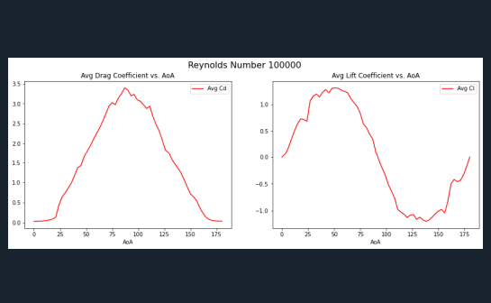

# spokeAnalysisSweep
Python script that sweeps Star-CCM+ Design Manager log files for rich data analysis and visualization.

### About  
This code is meant to sweep Star-CCM+ Design Manager Log files for rich
data analysis and visualization.

It was specifically made to capture 2D Airfoil polars at multiple Reynolds
numbers and Angles of Attacks for use with Blade Element Momentum applications.
In this case, the airfoil in question was a cross-section of the HED Trispoke.

Note that this is dependent on steady state RANS solutions of 2500 iterations.
Best for use with Spyder.  

## Data Analysis and Visualization  
  
*Figure 1:* The code parses through all simulation data and plots the raw drag and lift
coefficients versus iteration. The CFD simulation should be run with a RANS solver, so oscillating
solutions past the critical angle of attacks are to be expected. The mean coefficient values
are calculated using the pandas module, tabulated, and then plotted (red dotted line).  

  
*Figure 2:* Using this new smoothed data, average coefficient values are calculated for each Reynolds
number at every angle of attack from 0 to 180 degrees. These are then automatically tabulated and plotted.  

## User-Friendly Code  
I hope that anyone doing large data sweeps may be inspired or even use this code. It only requires a few
user inputs to work.  

## To-Do  
- Write-to-file function including all tables and plots
